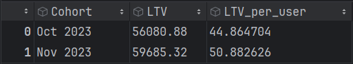
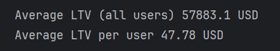
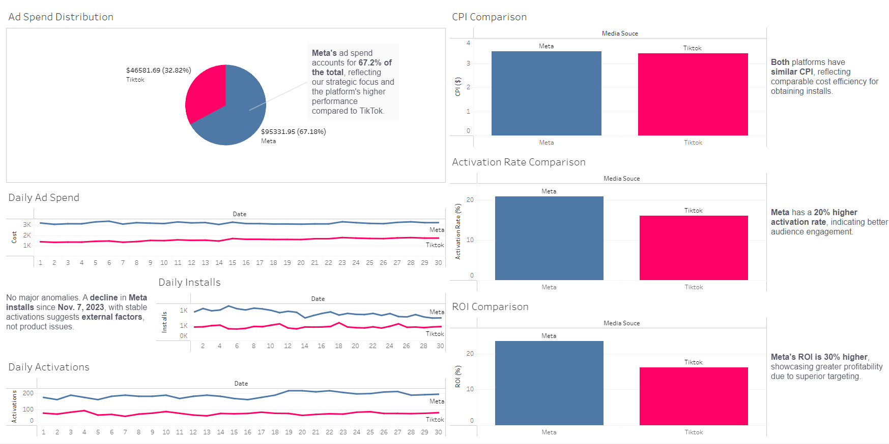

# tt_keiki
Test task solution for **Keiki**.

## Technologies:
- Python 3.11+
- SQL (PostgreSQL)
- Jupyter Notebook
- Matplotlib
- Seaborn
- Pandas
- Numpy

## Task #1 - SQL queries:
The source code with the SQL queries is available - [here](https://github.com/panicua/tt_keiki/tree/main/task_num_1/1st_TASK_KEIKI_SQL.txt).

## Task #2 - LTV calculation:
The source code with all the calculations, visualizations and conclusions is available - [here](https://github.com/panicua/tt_keiki/tree/main/task_num_2/ltv_calculations.ipynb).

### Short visualization and conclusions:
### LTV (6 months period) for each cohort (oct 2023, nov 2023)

### 
#### Conclusion:
Each user who starts our new subscription model brings in approximately $47.78 in revenue.

#### Observations:
- Our analysis suggests that each user subscribing to the new model, which includes a $4.99 trial fee, contributes an estimated $47.78 in revenue over six months. 
- Given that the trial now incurs a cost, it is possible that fewer users will initiate the trial, which may lead to changes in overall profit.

#### Additional Considerations:
1. **Comparison with Old Subscription Model:**
   - It is critical to compare the LTV of the old subscription model (with a free trial) against the new model to understand the overall impact. The historical data on old subscription LTV will be particularly valuable for this comparison.

2. **Retention Rates:**
   - We have estimated the retention rates for the new model based on historical data from the old model. However, there may be differences in retention that we are currently unaware of, which could affect the accuracy of our LTV calculation.
   - Obtaining more data on the retention rates specific to the new subscription model will improve our forecast accuracy.

3. **Machine Learning for Prediction:**
   - Implementing machine learning techniques, such as linear regression on our retention rate data, could refine our predictions for user retention and the resulting LTV.
   - A well-trained machine learning model could help predict trends more accurately, assuming it is provided with comprehensive and high-quality data.

4. **Future Data Collection:**
   - As more data on user behavior and retention becomes available for the new subscription model, we should regularly update our LTV calculations.
   - Continuous monitoring and analysis should be conducted to adapt strategies as needed.

## Task #3 - Metrics Visualization and Analysis:
- The source code with all the calculations and visualizations is available - [here](https://github.com/panicua/tt_keiki/tree/main/task_num_3/dashboard_calculations.ipynb).
- Shortened visualizations and conclusions - [Tableau](https://prod-uk-a.online.tableau.com/t/yuriipaziurich-1106298908/views/KeikiDashboard/KeikiDashboard)

Demo of Tableau: 

### Full Visualizations and conclusions:
### ***Pie chart for total cost between Meta and Tiktok.

#### Conclusions:
Analysis of our ad spending reveals that expenditures on Meta are significantly higher than on TikTok, with Meta accounting for roughly 67.2% of the total cost compared to TikTok's 32.8%. Given that both platforms have ad spendings in the tens of thousands of USD, the data can be considered stable and reliable for further processing. This allocation likely reflects our strategic focus or observed performance differences between the two platforms.

### ***Bar charts for CPI, activation rate and ROI. Meta vs. Tiktok.

#### Conclusions:
The analysis shows that while Meta and TikTok have similar Cost Per Install (CPI), significant differences exist in their activation rate and Return on Investment (ROI). Meta outperforms TikTok with approximately a 20% higher activation rate and a 30% higher ROI. This disparity may be attributed to Meta's superior targeting capabilities based on factors such as age, gender, and location. Consequently, Meta proves to be more profitable for us, which likely justifies our higher ad spending on this platform.

## Line charts for cost, installs, activations and expected revenue. Meta vs. Tiktok.

#### Conclusions:
There are no major anomalies observed, except for a noticeable decline in daily installations for Meta since approximately Nov. 7, 2023. My investigation into potential external factors, such as holidays or significant news events, did not reveal any clear causes for this decline. Despite the drop in installations, daily activations for Meta have remained steady, suggesting that the issue may not be related to our product. It is plausible that the "arbitrage creative" strategy for Meta has changed, potentially involving adjustments in ad visuals, targeting systems, or other unknown factors. The stability and slight increase in daily activations further supports the theory that the decline in installations is not due to changes in our product.
