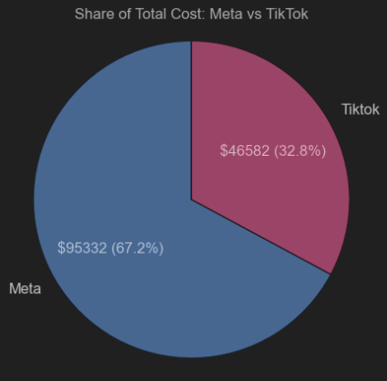
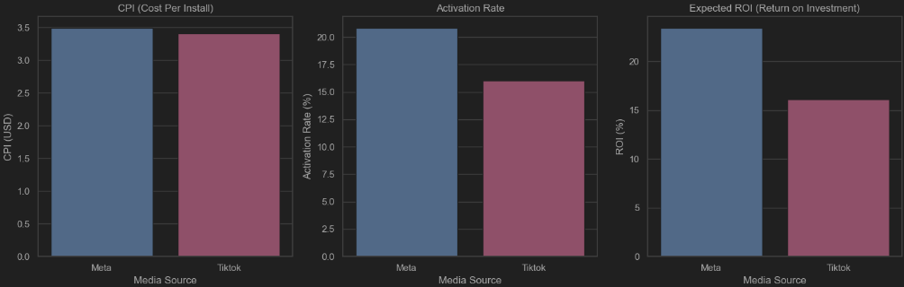
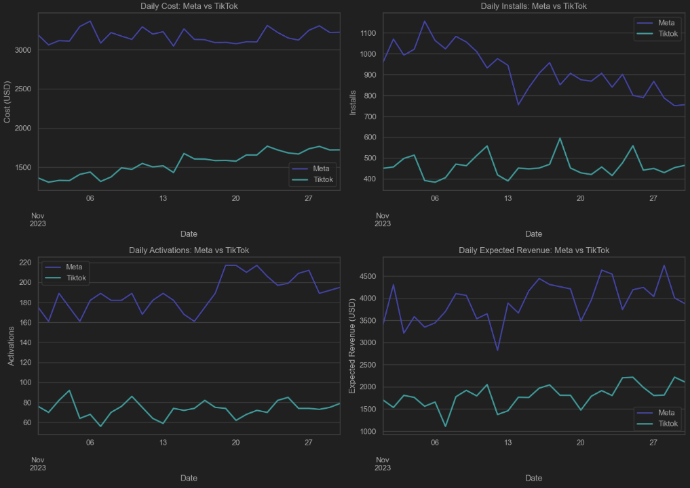

# tt_keiki
Test task solution for **Keiki**.

## Technologies:
- Python 3.11+
- SQL (PostgreSQL)
- Jupyter Notebook
- Matplotlib
- Seaborn
- Pandas
- Numpy

#### All the calculations for LTV per user and commentaries/conclusions were made in [calcs.ipynb](https://github.com/panicua/tt_keiki/blob/main/ltv_calculations.ipynb) file.

## Task #1 - SQL queries:
The source code with the SQL queries is available [>>> here](https://github.com/panicua/tt_keiki/tree/main/task_num_1/1st_TASK_KEIKI_SQL.txt).

## Task #3 - Metrics Visualization and Analysis:
The source code with all the calculations and visualizations is available [>>> here](https://github.com/panicua/tt_keiki/tree/main/task_num_3/dashboard_calculations.ipynb).

### Visualizations and conclusions:
### ***Pie chart for total cost between Meta and Tiktok.

#### Conclusions:
Analysis of our ad spending reveals that expenditures on Meta are significantly higher than on TikTok, with Meta accounting for roughly 67.2% of the total cost compared to TikTok's 32.8%. Given that both platforms have ad spendings in the tens of thousands of USD, the data can be considered stable and reliable for further processing. This allocation likely reflects our strategic focus or observed performance differences between the two platforms.

### ***Bar charts for CPI, activation rate and ROI. Meta vs. Tiktok.

#### Conclusions:
The analysis shows that while Meta and TikTok have similar Cost Per Install (CPI), significant differences exist in their activation rate and Return on Investment (ROI). Meta outperforms TikTok with approximately a 20% higher activation rate and a 30% higher ROI. This disparity may be attributed to Meta's superior targeting capabilities based on factors such as age, gender, and location. Consequently, Meta proves to be more profitable for us, which likely justifies our higher ad spending on this platform.

## Line charts for cost, installs, activations and expected revenue. Meta vs. Tiktok.

#### Conclusions:
There are no major anomalies observed, except for a noticeable decline in daily installations for Meta since approximately Nov. 7, 2023. My investigation into potential external factors, such as holidays or significant news events, did not reveal any clear causes for this decline. Despite the drop in installations, daily activations for Meta have remained steady, suggesting that the issue may not be related to our product. It is plausible that the "arbitrage creative" strategy for Meta has changed, potentially involving adjustments in ad visuals, targeting systems, or other unknown factors. The stability and slight increase in daily activations further supports the theory that the decline in installations is not due to changes in our product.
